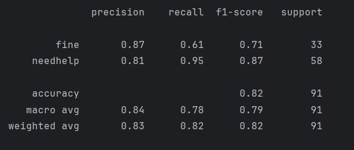

# Bot Brigade - Eyes4Resque

## Introduction
Eyes4Rescue is an AI-powered project aimed at detecting and responding to emergency situations involving individuals who have fallen and may need urgent assistance. The primary goal of this project is to reduce the time it takes to interfere with a given case. We want to be able to determine, based on signals like motion, if a person is in need of help and thus notify the emergency services as quickly as possible. 
 
By leveraging computer vision techniques such as YOLOv11 for object detection, MediaPipe for pose estimation and custom built classifiers, the project aims to make a difference in the time it takes to interfere in emergencies. The system analyzes video feeds to detect falls, track motion, and assess whether a person is in need of help based on their behavior after the fall. This project is a step toward creating more efficient and reliable emergency response systems through real-time video analysis and AI.
## General architecture & Ideas
***

### Detect and track people.
We accomplished this task by using [YOLOv11 from ultralytics](https://docs.ultralytics.com/models/yolo11/). Ultralytics offers tools for object detection and tracking. When processing a video with these trackers, they generate a bounding box for each tracked individual in every frame. 


### Detect a fall (or a person laying on the ground).
For the detection of a fall we fine-tuned a yolov11n model. this fine-tuned model predicts if a person is on the floor or not. The fine-tuning is done by using a custom set of training data which contain images and labels of people on the floor and people not on the floor.

However, we have observed that the fine-tuned model is not performing as accurately as expected. Despite retraining multiple models on enhanced datasets, the performance has reached a plateau, showing no further improvement. This presents a significant challenge as we aim to achieve optimal performance.

To address this, we maybe want to explore alternative approaches for fall detection in the future. Our current ideas include:
- Adaboost: Creating a few weak classifiers (stomps) for example: bbox area over time, aspect ratio, ... and feeding these classifiers to an adaboost algorithm to create 1 good lightweight classifier for detecting a fall alongside yolo for the person detection.


### Motion detection of people that fell on the ground (or lay down).
Detecting individuals falling to the ground is not sufficient to trigger a 112 alert, as the person may simply stand up and walk away afterward. In contrast, individuals who have suffered a cardiac arrest or stroke typically remain motionless after falling, requiring immediate assistance.

To check for motion after a person is detected as being on the floor, we implemented a simple distance based motion tracking that will look at the distance between the bbox coordinates in the current frame and in the previous frame. This distance is then campared to a factor calculated by a dynamic number (area of bbox) devided by a hard coded motion threshold.

This simple yet effective method allows real-time detection and logging of motion events, making it ideal for surveillance applications.

### Detection of motionless people that fell on the floor and effectively need help.
Detecting whether an individual is motionless on the ground is not sufficient to trigger a 112 alert, as it’s possible for someone to be on the ground (in the grass taking a nap) without motion without.
Our goal is to differentiate between situations where motionless individuals are fine and those where they are experiencing an emergency.

Our current classifiers are all pose based and consist of:
- mediapipe w/ random forest classifier
- yolo-pose w/ random forest classifier
- yolo-pose w/ neural network

As of right now our yolo-pose w/ neural network is the best performing classifier we have:


Collecting more data 

## Results
For a set of 38 videos (17 negative/21 positive) the algorithm scored

- 88% precision
- 67% recall
- 12.5% false alert rate


This marks a significant improvement compared to previous weeks. However, the evaluation highlights areas where our algorithm is still falling short. For the classifier specifically we can see that our classifier is working really well only making 2 mis-classifications (red). We believe this is also preventable by using more training data.  On the other hand, the fine-tuned YOLO model fails to perform accurately alot of the time, resulting in missed alert detections (yellow). We believe this is also preventable by trying other approaches as discussed earlier in this README.


## The sources
***

### Entry point: `main.py` 
Inside the source directory (`src`) you will find the main entrypoint of our application. When opening this script there are 
several configurable variables that influence the performance of the application running over videos. These variables are used 
for changing approaches on how you want to evaluate a certain video with different technology. Running this script will start the 
video evaluation process.  

Example:
```python
#######################################################
## fall detection configuration ##
#######################################################
""" Specify custom weights vs. stock weights """
use_custom_fall_detection   = False # Will use custom weights
use_ft_yolo                 = True  # Will use stock weights 
assert not (use_custom_fall_detection and use_ft_yolo), "only 1 variable can be true at the same time"
```
Before running the entry point, make sure python version 3.11 is installed and you have installed all requirements with the 
following command: 
```commandline
pip install -r requirements.txt
```

If all goes well, you should be able to run the alert detector script!

### Classifiers: 
``` 
├───classifiers
│   ├───img
│   │   └───cnn
│   ├───pose
│   │   ├───nn
│   │   │   └───yolo_pose
│   │   ├───rf
│   │   │   ├───mediapipe
│   │   │   └───yolo_pose
│   ├───pose_classifier
│   │   └───pose
│   │       └───yolo_pose
├───fall_detector
│   ├───adaboost
│   ├───resnet
│   └───xgboost
└───metrics 
```
This is an overview of the current structure of our models directory. This is where you will find all files used for 
training the classifiers and fall detector. Running the script contained inside each directory will start the training process 
of the classifier or detector if the necessary data is supplied.  
 
The repository does not include any data or model files for you, so you will need to provide your own datasets and pre-trained models to proceed.
You can also check the Bot Brigade MinIO bucket for weight files. 

# Results
## Random Forest classifier YOLO Pose 


# Open Issues

***
- Things to do are registered in [github tasks](https://github.com/mxttywxtty/bot-brigade/issues?q=is%3Aissue+is%3Aopen+label%3Atask)
- Bugs are registered in [known open bugs](https://github.com/mxttywxtty/bot-brigade/issues?q=is%3Aissue+is%3Aopen+label%3Abug+)


  
